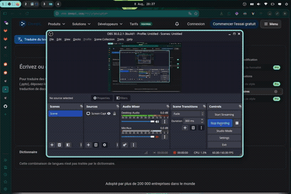
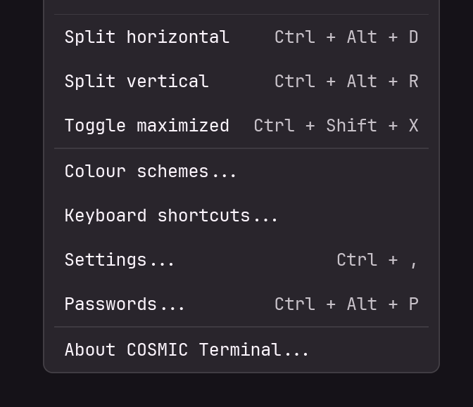

# SystemWallColor

*[English version](README.md)*



Synchronisation automatique des thèmes système avec le fond d'écran sur **COSMIC Desktop** (Pop!_OS).

Dès que vous changez de wallpaper ou de mode clair/sombre dans COSMIC, SystemWallColor :
1. Génère un thème COSMIC assorti avec [Matugen](https://github.com/InioX/matugen) et l'applique automatiquement
2. Génère une palette de couleurs terminal avec [Pywal](https://github.com/dylanaraps/pywal)
3. Synchronise (en option) le thème de Firefox avec [Pywalfox](https://github.com/Frewacom/pywalfox)
4. Génère (en option) des thèmes clair/sombre assortis pour l'éditeur [Zed](https://zed.dev)
5. Génère (en option) un snippet CSS assorti pour [Obsidian](https://obsidian.md)

Le tout tourne en arrière-plan via un service **systemd** qui surveille les changements en temps réel.

## Prérequis

- **Pop!_OS avec COSMIC Desktop**, ou **Arch/EndeavourOS/Manjaro/CachyOS**, ou **Fedora** avec COSMIC Desktop
- Accès `sudo` (pour l'installation des dépendances système)
- Firefox (optionnel, uniquement si vous voulez la synchronisation du thème navigateur)
- Zed (optionnel, uniquement si vous voulez la synchronisation du thème éditeur)
- Obsidian (optionnel, uniquement si vous voulez la synchronisation du thème notes)

## Installation

```bash
git clone https://gitlab.com/Ylamm/systemwallcolor.git
cd systemwallcolor
chmod +x install.sh
./install.sh [options]
```

`install.sh` détecte automatiquement votre distribution (Ubuntu/Pop!_OS/Debian → `apt`, Arch et dérivées → `pacman`, Fedora → `dnf`) et installe les bons paquets système en conséquence.

Les paquets installés sont Cargo, Pywal, Pywalfox et Matugen. En cas de problème, vous pouvez les installer manuellement.

**Le cœur du projet (thème COSMIC + palette terminal Pywal) est toujours installé.** Les intégrations d'applications (Firefox, Zed, Obsidian) sont optionnelles et s'activent via des flags à l'installation, ou directement en éditant le fichier `config.json` par la suite :

| Flag | Effet |
|---|---|
| *(aucun)* | Cœur seul |
| `--firefox` | Active aussi la synchronisation du thème Firefox (Pywalfox) |
| `--zed` | Active aussi la synchronisation du thème Zed |
| `--obsidian` | Active aussi la synchronisation du thème Obsidian |
| `--all` | Active tout |
| `--help` | Affiche l'aide |

Les flags sont combinables, ex : `./install.sh --firefox --zed`.

> **Relancer `install.sh` met à jour la configuration active pour correspondre aux flags passés.** Si un composant était activé précédemment et que vous relancez le script sans son flag, sa section Matugen est automatiquement retirée de `~/.config/matugen/config.toml` — il n'est donc plus généré.

Si vous activez la synchronisation Firefox, installez également l'extension [Pywalfox](https://addons.mozilla.org/en-US/firefox/addon/pywalfox/) depuis le store officiel.

> ⚠️ **Au premier lancement**, changez une première fois de fond d'écran pour que le service détecte le changement et applique le thème initial.

## Fonctionnement

| Composant | Rôle |
|---|---|
| `swcw.sh` | Surveille les fichiers de configuration COSMIC via `inotifywait` |
| `swc.py` | Exécuté à chaque changement détecté ; orchestre Matugen, Pywal, Pywalfox et l'application du thème |
| `cosmic-watch.service` | Service systemd utilisateur qui garde `swcw.sh` actif en permanence |

## Modifier la configuration sans réinstaller

Le fichier `~/.local/bin/SystemWallColor/config.json` contrôle quelles applications sont synchronisées (`firefox`, `zed`, `obsidian`) ainsi que les paramètres de Matugen (`source-color-index`, `scheme`). Vous pouvez l'éditer directement — les changements prennent effet au prochain déclenchement du service, sans avoir besoin de relancer `install.sh`.

> ⚠️ Notez que relancer `install.sh` régénère entièrement ce fichier à partir des flags passés, écrasant toute modification manuelle.

### Thème Zed

*(activé avec `--zed` ou `--all`)*

SystemWallColor génère des thèmes **Zed** assortis ("Matugen Dark" / "Matugen Light") à partir des couleurs de votre fond d'écran.

Les templates (`matugen/templates/zed-colors-dark.json` et `zed-colors-light.json`) sont copiés et les sections `[templates.zeddark]` / `[templates.zedlight]` sont ajoutées à votre config Matugen. Le thème généré est écrit directement dans le chemin de config Flatpak de Zed (`~/.var/app/dev.zed.Zed/config/zed/themes/`), puisque Zed sur Pop!_OS est généralement installé via Flatpak.

Pour l'activer dans Zed :
1. Ouvrez la palette de commandes (`ctrl-k ctrl-t`)
2. Sélectionnez **Matugen Dark** ou **Matugen Light**

> ⚠️ Si vous avez installé Zed autrement (binaire natif, apt, snap), modifiez les valeurs `output_path` de `zeddark`/`zedlight` dans `~/.config/matugen/config.toml` pour pointer plutôt vers `~/.config/zed/themes/`.

### Thème Obsidian

*(activé avec `--obsidian` ou `--all`)*

SystemWallColor génère un snippet CSS assorti pour **Obsidian**, avec des variantes claire et sombre séparées, via la section `[templates.obsidian]` de votre config Matugen.

> ⚠️ **Le chemin de sortie est codé en dur pour un vault spécifique** (`~/Documents/Obsidian Vault/.obsidian/snippets/Matugen.css` par défaut). Modifiez `output_path` dans `~/.config/matugen/config.toml` pour correspondre à l'emplacement de votre propre vault avant que ça fonctionne.

Pour l'activer dans Obsidian :
1. Ouvrez **Settings → Appearance → CSS snippets**
2. Activez le snippet **Matugen**

## Vérifier que le service tourne

```bash
systemctl --user status cosmic-watch.service
```

## Suivre les logs en direct

```bash
journalctl --user -u cosmic-watch.service -f
```

## Désinstallation

```bash
chmod +x uninstall.sh
./uninstall.sh
```

## Limitations connues

- Fonctionne uniquement avec **COSMIC Desktop** (dépend de `cosmic-settings` et des fichiers de config spécifiques à COSMIC).
- La synchronisation Firefox nécessite que le navigateur soit ouvert et l'extension Pywalfox installée côté navigateur.
- **Les couleurs internes de cosmic-term (fond, texte) ne peuvent pas être automatisées actuellement.** cosmic-term ne recharge pas son thème même si le fichier de configuration est modifié en arrière-plan. Pour appliquer manuellement les nouvelles couleurs :
  1. Ouvrez cosmic-term
  2. **View → Color schemes... → Import**

     
  3. Sélectionnez `~/.cache/wal/cosmic_term.ron`
  4. Sélectionnez le thème "Pywal" dans la liste
- **La synchronisation du thème Zed nécessite un redémarrage de Zed** après la première génération pour que le nouveau thème apparaisse dans le sélecteur. Les changements de wallpaper suivants mettent à jour le fichier de thème en place, sans redémarrage nécessaire.
- **Le chemin du vault Obsidian est codé en dur** dans `matugen/config.toml` et doit être modifié manuellement pour correspondre à votre propre vault avant que le snippet soit généré au bon endroit.
- **Le support Arch/Fedora n'est pas testé** — les noms de paquets utilisés pour `pacman`/`dnf` sont une meilleure estimation et peuvent nécessiter des ajustements.

## Sources

- Les templates matugen pour Zed s'inspirent de https://github.com/InioX/matugen-themes/blob/main/templates/zed-colors.json
- Le template matugen pour Obsidian vient de https://github.com/Simorg2002/obsidian-matugen-template/tree/main

# À venir
- [x] Ajouter le choix du mode/backend de Matugen.
- [ ] Détecter automatiquement si les applications (Zed, Obsidian, etc.) sont installées via Flatpak ou nativement, et adapter les chemins de sortie Matugen (`output_path`) en conséquence.
- [?] Implémenter le choix du fond d'écran manuel ("Suivre COSMIC" vs "Image personnalisée").
- [ ] Ajouter les réglages de saturation et de luminosité pour matugen.
- [ ] Ajouter des interrupteurs pour d'autres applications synchronisées (Alacritty, Discord, etc.).
- [ ] Permettre la configuration des chemins personnalisés (Obsidian / Zed).
- [ ] Mettre en place un délai (debounce) de détection pour le démon inotify.
- [ ] Intégrer les notifications de bureau (notify-send).
- [ ] Ajouter un système de commandes personnalisées (Hooks post-génération).
